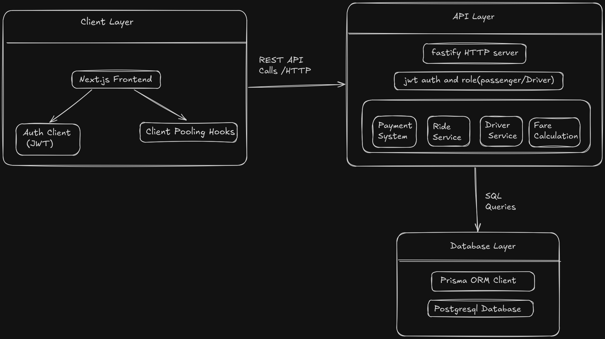
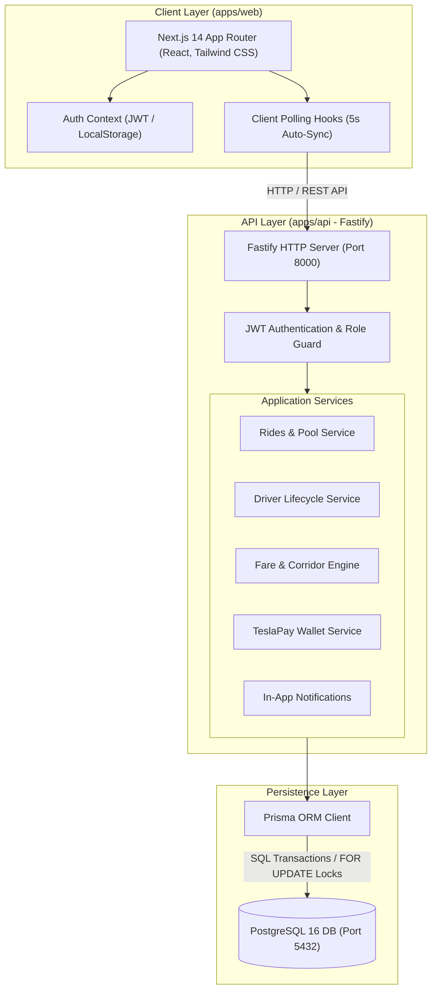
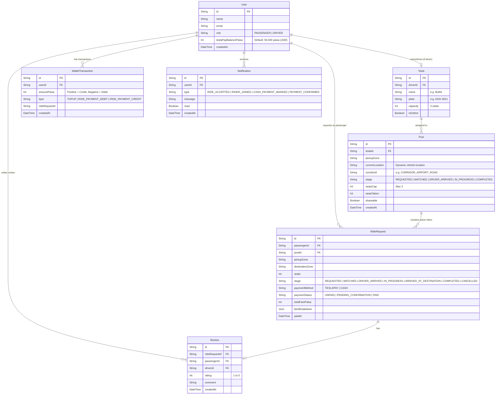

# Dhaka Tesla Pool
> **Share a seat. Split the fare. Survive Dhaka traffic.**

[](https://www.typescriptlang.org/)
[](https://nextjs.org/)
[](https://fastify.dev/)
[](https://www.postgresql.org/)
[](https://www.prisma.io/)
[](https://tailwindcss.com/)
[](https://vitest.dev/)

---

## 📌 Table of Contents
- [1. Problem Statement & The Story Cast](#1-problem-statement--the-story-cast)
- [2. System Architecture](#2-system-architecture)
- [3. Entity-Relationship Diagram (ERD)](#3-entity-relationship-diagram-erd)
- [4. Core Features Implemented](#4-core-features-implemented)
- [5. Application Screenshots & UI Showcase](#5-application-screenshots--ui-showcase)
- [6. Technology Choices & Justification](#6-technology-choices--justification)
- [7. Concurrency & Overbooking Prevention](#7-concurrency--overbooking-prevention)
- [8. Fare Calculation & Financial Precision](#8-fare-calculation--financial-precision)
- [9. Route Direction & Reverse-Passenger Prevention](#9-route-direction--reverse-passenger-prevention)
- [10. Ride Lifecycle & State Machine](#10-ride-lifecycle--state-machine)
- [11. Project Structure](#11-project-structure)
- [12. Local Setup & Installation](#12-local-setup--installation)
- [13. Demo Credentials](#13-demo-credentials)
- [14. Testing Suite](#14-testing-suite)
- [15. Bonus: "If Oi Tesla Goes Viral" (1M Scale Blueprint)](#15-bonus-if-oi-tesla-goes-viral-1m-scale-blueprint)
- [16. AI Usage Disclosure](#16-ai-usage-disclosure)
- [17. Git Workflow & Branching](#17-git-workflow--branching)
- [18. Six-Minute Demo Video Walkthrough](#18-six-minute-demo-video-walkthrough)

---

## 1. Problem Statement & The Story Cast

Dhaka's rush-hour traffic on Airport Road and Mirpur-Gulshan link roads is notorious. Commuters travelling in the exact same direction often take separate vehicles or wait hours for scarce transport. 

**The Banani Rush-Hour Story:**
- **Jashim** drives **"Bullet"**, his 3-seater, battery-powered, entirely unaffiliated electric "Tesla".
- **Nusrat**, running late, requests a ride from **Banani** to **Mohakhali**.
- Two minutes later, **Rafiq** requests almost the same route from **Banani** to **Gulshan 1**.
- Thirty seconds later, **Shirin** wants the last remaining seat.

**Dhaka Tesla Pool** is a real-time ride-pooling platform built to:
1. Dynamically match passengers moving along compatible corridors without exceeding Bullet's strict 3-seat capacity.
2. Fairly calculate, discount, and split the fare leg-by-leg so passengers save 30% when sharing while Jashim earns a higher combined payout.
3. Prevent reverse-direction bookings (e.g. travelling backward from Mohakhali to Banani while the vehicle heads southbound toward Bashundhara).
4. Provide seamless exit payments via simulated **TeslaPay Wallet** (atomic wallet debit/credit) or **Cash** (with driver verification handshake).
5. Maintain immutable ride history, passenger reviews, and live notifications.

---

## 2. System Architecture

The project is structured as a high-performance **monorepo**:
- **Frontend (`apps/web`)**: Next.js 14 App Router with React, Tailwind CSS, and Lucide Icons.
- **Backend (`apps/api`)**: Fastify Node.js server with TypeScript, Prisma ORM, and JWT authentication.
- **Database**: PostgreSQL 16 relational database with row-level locks and ACID transaction isolation.

### Main Architecture Diagram


### High-Level Component Flow


---

## 3. Entity-Relationship Diagram (ERD)



---

## 4. Core Features Implemented

### 🚗 Passenger Features
- **Instant Authentication**: Login and registration with role differentiation and preloaded ৳500 demo wallet balance.
- **Corridor & Shared Route Discovery**: Browse all open pools system-wide with real-time seat availability, corridor progression path, and vehicle current location badge.
- **Any-to-Any Boarding**: Board from any forward stop along the vehicle's route and pay only for your shared journey portion.
- **Reverse-Direction Protection**: UI and backend reject reverse bookings (e.g., Mohakhali to Banani while vehicle travels southbound).
- **Pay on Exit (Two Modes)**:
  - **TeslaPay Wallet**: Atomic balance transfer from passenger to driver with automated verification.
  - **Cash Payment**: Driver confirmation handshake prevents fraud.
- **Cancellation Protection**: Cancellation is permitted strictly before a driver accepts. Once accepted, cancellation is locked to protect driver dispatch.
- **Driver Reviews & Star Ratings**: 1-5 star ratings with optional comments.

### 🚙 Driver Features (Jashim & Bullet)
- **Active Pool Management**: Review incoming ride requests, accept pools, and transition stages (`DRIVER_ARRIVED` → `IN_PROGRESS` → `COMPLETED`).
- **Cash Confirmation Handshake**: Single-click verification for passengers paying cash.
- **Settlement Overview**: Live breakdown of which passengers paid via TeslaPay and which paid cash.
- **Driver History**: Completed rides, earnings tally, and passenger ratings.

---

## 5. Application Screenshots & UI Showcase

> *Note: Place your UI screenshots in the `docs/screenshots/` directory or link them directly below.*

### 1. Passenger Ride Discovery & Shared Route Joining
*Passengers select boarding and dropoff points along the vehicle's forward corridor with live 30% discount preview.*

<!-- Replace with your screenshot -->
```
┌────────────────────────────────────────────────────────────────────────┐
│ [ SCREENSHOT PLACEHOLDER: Browse Shared Rides & Live Route Heading ]   │
│                                                                        │
│ Suggested image: docs/screenshots/browse-rides.png                     │
└────────────────────────────────────────────────────────────────────────┘
```
*(Path: `docs/screenshots/browse-rides.png`)*

---

### 2. Live Corridor Progression & Ride Status
*Clear visual tracking of vehicle current location, co-riders, fare breakdown, and payment status.*

<!-- Replace with your screenshot -->
```
┌────────────────────────────────────────────────────────────────────────┐
│ [ SCREENSHOT PLACEHOLDER: Passenger Active Ride & Corridor Route ]     │
│                                                                        │
│ Suggested image: docs/screenshots/my-rides-tracking.png                │
└────────────────────────────────────────────────────────────────────────┘
```
*(Path: `docs/screenshots/my-rides-tracking.png`)*

---

### 3. Exit Payment Handshake (TeslaPay vs Cash)
*Passenger pays upon vehicle exit. TeslaPay settles automatically, while Cash enters pending driver confirmation.*

<!-- Replace with your screenshot -->
```
┌────────────────────────────────────────────────────────────────────────┐
│ [ SCREENSHOT PLACEHOLDER: Exit Payment & Driver Cash Confirmation ]    │
│                                                                        │
│ Suggested image: docs/screenshots/payment-handshake.png                │
└────────────────────────────────────────────────────────────────────────┘
```
*(Path: `docs/screenshots/payment-handshake.png`)*

---

### 4. Driver Dashboard (Jashim & Bullet)
*Driver sees active pool capacity, rider list, stages, and cash receipt verification.*

<!-- Replace with your screenshot -->
```
┌────────────────────────────────────────────────────────────────────────┐
│ [ SCREENSHOT PLACEHOLDER: Driver Active Pools Dashboard ]              │
│                                                                        │
│ Suggested image: docs/screenshots/driver-dashboard.png                 │
└────────────────────────────────────────────────────────────────────────┘
```
*(Path: `docs/screenshots/driver-dashboard.png`)*

---

### 5. Profile & TeslaPay Wallet Transactions
*Wallet balance overview, instant top-up (capped at ৳50,000), and transaction ledger.*

<!-- Replace with your screenshot -->
```
┌────────────────────────────────────────────────────────────────────────┐
│ [ SCREENSHOT PLACEHOLDER: TeslaPay Wallet & Transaction History ]      │
│                                                                        │
│ Suggested image: docs/screenshots/wallet-profile.png                   │
└────────────────────────────────────────────────────────────────────────┘
```
*(Path: `docs/screenshots/wallet-profile.png`)*

---

## 6. Technology Choices & Justification

| Layer | Picked | Realistic Alternatives | Why It Fits This MVP | What Would Make Us Switch Later |
| :--- | :--- | :--- | :--- | :--- |
| **Frontend** | **Next.js 14 (App Router)** | Vite + React, Remix, Vue.js | Native SSR/SSG, fast component routing, seamless TypeScript integration, and unified full-stack developer experience. | If client bundle size becomes critical on ultra-low-end 2G mobile devices, we could switch to a lightweight Vite + Preact PWA. |
| **Backend** | **Fastify (Node.js)** | Express, NestJS, Go/Fiber | 3x to 5x faster throughput than Express, built-in JSON schema validation, lower memory footprint, and async plugin ecosystem. | If team size scales to 50+ engineers requiring strict modular enterprise abstraction, NestJS or Go microservices might be adopted. |
| **Database** | **PostgreSQL 16** | MySQL, MongoDB, SQLite | ACID compliance, robust pessimistic row-locking (`FOR UPDATE`), advanced indexing, and zero-risk transactional seat counting. | If geospatial ride matching at millions of concurrent coordinate queries requires document sharding, Mongo/DynamoDB with Redis geo-hashing could be introduced. |
| **ORM** | **Prisma** | Drizzle, TypeORM, Kysely | Type-safe migrations, auto-generated TypeScript clients, intuitive relations, and rapid iteration speed for MVP schemas. | If raw query performance and sub-millisecond query generation under high load is needed, Drizzle or raw Kysely would replace it. |
| **Authentication** | **JWT (`@fastify/jwt`) + Bcrypt** | Session cookies, NextAuth, Auth0 | Stateless, low-latency token verification, no centralized session store needed for MVP, and simple role separation. | At high scale, OAuth2/OIDC with Redis token revocation and refresh token rotation would be added for session invalidation. |
| **Testing** | **Vitest** | Jest, Mocha | Near-instant startup, native TypeScript/ESM support, compatibility with Vite/Next.js toolchains, and parallel test execution. | Vitest handles both unit and integration tests seamlessly; no switch needed in the near term. |

---

## 7. Concurrency & Overbooking Prevention

### The Problem Scenario
Bullet has **1 seat remaining**. At 8:43:00 AM, **Nusrat** and **Shirin** both click *"Confirm & Join"* at the exact same millisecond. In a naive system without concurrency control:
1. Thread A checks `seatsTaken < 3` (True, seatsTaken = 2).
2. Thread B checks `seatsTaken < 3` (True, seatsTaken = 2).
3. Thread A increments seats: `seatsTaken = 3`.
4. Thread B increments seats: `seatsTaken = 4` (**OVERBOOKED!** Bullet only has 3 seats).

### Current MVP Implementation
We solve this using **Pessimistic Row-Level Locking** in PostgreSQL within an ACID transaction:

```typescript
await prisma.$transaction(async (tx) => {
  // 1. Lock the Pool row FOR UPDATE across competing transactions
  const [lockedPool] = await tx.$queryRaw`
    SELECT id, "seatsCap", "seatsTaken", stage 
    FROM "Pool" 
    WHERE id = ${poolId} 
    FOR UPDATE
  `;

  // 2. Strict capacity assertion on locked state
  if (lockedPool.seatsTaken + requestedSeats > lockedPool.seatsCap) {
    throw new RideError(409, 'No available seats remaining in this pool', 'POOL_FULL');
  }

  // 3. Atomically create the ride and increment seatsTaken
  await tx.rideRequest.create({ ... });
  await tx.pool.update({
    where: { id: poolId },
    data: { seatsTaken: lockedPool.seatsTaken + requestedSeats }
  });
});
```
- The second concurrent request is held at `SELECT ... FOR UPDATE` until the first completes.
- Once released, the second request immediately encounters `seatsTaken === 3` and is rejected with `409 Conflict: POOL_FULL`.

### What We Would Change at Scale (100k+ TPS)
1. **Redis Distributed Locks / Lua Scripts**: Maintain atomic seat counters in Redis (`DECRBY available_seats`). The database is only touched after seat reservation succeeds in memory.
2. **Optimistic Locking**: Add a `version` column to the `Pool` table (`UPDATE "Pool" SET seats = ..., version = version + 1 WHERE id = ... AND version = expectedVersion`). Competing transactions retry with exponential backoff.
3. **Queue-Based Fair Queuing**: Inbound join requests for popular corridors are placed onto a FIFO Kafka/RabbitMQ partition per pool, guaranteeing serialized processing without DB lock contention.

---

## 8. Fare Calculation & Financial Precision

### The Formula
$$\text{passengerFare} = \text{baseFare} + \text{distanceCharge} - \text{poolDiscount}$$

- **Base Fare**: ৳100 (Solo trip minimum).
- **Per-Km Rate**: ৳50 / km (based on predefined Dhaka zone distance matrix).
- **Pooling Discount**: **30% off** any shared corridor segment when 2 or more passengers share seats.

### Why Integer Paisa/Poysha Over Decimals
Floating-point arithmetic in JavaScript and SQL is prone to IEEE-754 precision errors:
```javascript
0.1 + 0.2 = 0.30000000000000004 // Fatal for financial ledgers!
```
In **Dhaka Tesla Pool**, all financial amounts are strictly stored as **integer Paisa** (1 BDT = 100 Paisa):
- ৳50.00 = `5000` paisa
- ৳35.00 = `3500` paisa
- Fares are converted to BDT only at the presentation layer using `formatBDT()`.

---

## 9. Route Direction & Reverse-Passenger Prevention

A critical issue in ride-pooling is direction compatibility. If Bullet is travelling Southbound along Airport Road:
$$\text{UTTARA (0)} \to \text{BANANI (1)} \to \text{MOHAKHALI (2)} \to \text{GULSHAN (3)} \to \text{BASHUNDHARA (4)}$$

A passenger at **Mohakhali (Index 2)** attempting to book to **Banani (Index 1)** is travelling Northbound (reverse direction). A Southbound vehicle cannot reverse course.

### How It Is Handled:
1. **Corridor Index Validation**:
   ```typescript
   if (corridor.zones.indexOf(pickup) >= corridor.zones.indexOf(destination)) {
     throw new RideError(400, 'Cannot join ride: reverse direction route');
   }
   ```
2. **Current Vehicle Location Tracking**: If Bullet is currently at Mohakhali, passengers cannot board at Uttara or Banani (`pickupIndex < currentLocIndex`).
3. **Frontend Smart Filtering**: The dropoff dropdown dynamically presents **only forward stops** past the selected boarding point, with real-time direction alerts.

---

## 10. Ride Lifecycle & State Machine

```
[REQUESTED] 
    │
    ├── (Driver accepts pool) ─────────────► [MATCHED] (Cancellation Locked)
    │                                            │
    └── (Passenger cancels before driver)        ▼
            │                            [DRIVER_ARRIVED]
            ▼                                    │
       [CANCELLED]                               ▼
                                           [IN_PROGRESS]
                                                 │
                                                 ▼
                                     [ARRIVED_AT_DESTINATION]
                                                 │
                                                 ▼
                                            [COMPLETED]
```

- **Cancellation Rule**: Allowed strictly while in `REQUESTED` stage before driver acceptance. Once a driver accepts (`MATCHED` or later), cancellations are locked.
- **Pay on Exit Handshake**: The passenger exits and pays at `ARRIVED_AT_DESTINATION`. Once settled, the trip is marked `COMPLETED`.

---

## 11. Project Structure

```
dhaka-tesla-pool/
├── apps/
│   ├── api/                          # Fastify Backend API Server
│   │   ├── prisma/
│   │   │   ├── schema.prisma         # Data models, enums & relations
│   │   │   └── seed.ts               # Seed data (Jashim, Nusrat, Rafiq, Shirin)
│   │   ├── src/
│   │   │   ├── config/
│   │   │   │   ├── fare.ts           # Fare engine & discount calculations
│   │   │   │   └── zones.ts          # Dhaka zones, matrix & corridors
│   │   │   ├── modules/
│   │   │   │   ├── auth/             # Login, signup & JWT verification
│   │   │   │   ├── driver/           # Driver trips, accept, confirm-cash
│   │   │   │   ├── notifications/    # Real-time passive alerts
│   │   │   │   ├── rides/            # Request, browse, join, cancel, pay
│   │   │   │   └── wallet/           # TeslaPay topup & transaction ledger
│   │   │   ├── app.ts                # Fastify app setup & routes
│   │   │   └── server.ts             # Server entrypoint (Port 8000)
│   │   └── package.json
│   │
│   └── web/                          # Next.js 14 Frontend Application
│       ├── app/
│       │   ├── page.tsx              # Main dashboard tabs (Browse, My Rides, Driver)
│       │   ├── profile/page.tsx      # Profile, ratings & TeslaPay Wallet tab
│       │   └── layout.tsx            # Global Navbar, Notifications bell, Auth modal
│       ├── components/
│       │   ├── driver/active-pools.tsx
│       │   ├── passenger/
│       │   │   ├── browse-shared-rides.tsx
│       │   │   ├── my-rides.tsx
│       │   │   └── request-ride-form.tsx
│       │   └── ui/                   # Reusable badges, cards & ratings
│       ├── lib/
│       │   ├── api.ts                # Axios HTTP client & typed endpoints
│       │   ├── auth-context.tsx      # Auth state management
│       │   └── utils.ts              # Currency, formatting & zone emojis
│       └── package.json
│
├── docs/                             # Architecture diagrams & documentation
├── Architecture_Diagram.png          # System Architecture Diagram
├── docker-compose.yml                # PostgreSQL container orchestration
├── .env.example                      # Sample environment variables
└── README.md                         # Project documentation
```

---

## 12. Local Setup & Installation

### Prerequisites
- [Node.js](https://nodejs.org/) (v18.x or v20.x recommended)
- [Docker](https://www.docker.com/) & Docker Compose
- `npm` or `pnpm`

### Step 1: Clone the Repository
```bash
git clone https://github.com/your-username/dhaka-tesla-pool.git
cd dhaka-tesla-pool
```

### Step 2: Configure Environment Variables
Copy the sample environment files:
```bash
cp apps/api/.env.example apps/api/.env
cp apps/web/.env.example apps/web/.env.local
```

### Step 3: Start the PostgreSQL Database via Docker
```bash
docker compose up -d
```
*This starts PostgreSQL 16 on `localhost:5432` with database `dhaka_tesla_pool`.*

### Step 4: Install Dependencies & Setup Database
```bash
# Install root & workspace packages
npm install

# Setup backend schema & run migrations
cd apps/api
npx prisma db push

# Seed the database with the story cast (Jashim, Bullet, Nusrat, Rafiq, Shirin)
npm run seed
```

### Step 5: Start Development Servers
Open two terminal windows:

**Terminal 1 — API Server (Port 8000):**
```bash
cd apps/api
npm run dev
```

**Terminal 2 — Web Frontend (Port 3000):**
```bash
cd apps/web
npm run dev
```

Visit **`http://localhost:3000`** in your browser.

---

## 13. Demo Credentials

The database is pre-seeded with the story cast and default password `password123`:

| Role | Name | Email | Password | Initial TeslaPay Balance | Details |
| :--- | :--- | :--- | :--- | :--- | :--- |
| **Driver** | **Jashim** | `jashim@gmail.com` | `password123` | ৳500.00 | Drives **Bullet** (DHA-3021, 3 seats) |
| **Passenger** | **Nusrat** | `nusrat@gmail.com` | `password123` | ৳500.00 | Banani → Mohakhali commuter |
| **Passenger** | **Rafiq** | `rafiq@gmail.com` | `password123` | ৳500.00 | Banani → Gulshan 1 commuter |
| **Passenger** | **Shirin** | `shirin@gmail.com` | `password123` | ৳500.00 | Claims final seat on corridor |

---

## 14. Testing Suite

The project includes **53 automated unit and integration tests** verifying critical pooling algorithms, fare calculations, and edge cases.

To run the test suite:
```bash
cd apps/api
npm test
```

### Core Behaviors Tested:
- **Capacity Limits**: Bullet's 3-seat capacity cannot be exceeded under concurrent join requests.
- **Fare Calculations**: Nusrat and Rafiq's 30% discount matches manual leg-by-leg math down to the exact paisa.
- **Direction Enforcement**: Rejects reverse bookings (e.g., Mohakhali to Banani on a Southbound trip).
- **Current Location Lock**: Rejects boarding at stops the vehicle has already passed.
- **Cancellation Constraints**: Rejects passenger cancellation once driver accepts (`MATCHED` stage).
- **Safe Pool Exit**: Cancelling does not corrupt remaining riders' fares or trigger mismatched pickup errors.

---

## 15. Bonus: "If Oi Tesla Goes Viral" (1M Scale Blueprint)

If Dhaka Tesla Pool scales from 1 Tesla to **1,000,000 passengers** and **100,000 drivers**, here is our architectural evolution strategy:

```
[Clients: Mobile Apps & Web]
             │ (HTTPS / WSS)
    [Cloudflare CDN & DDoS Protection]
             │
    [NGINX / Envoy API Gateway & Rate Limiter]
             │
 ┌───────────┴──────────────────────────────┐
 │          Microservice Cluster            │
 │  ┌──────────────┐      ┌──────────────┐  │
 │  │ Auth Service │      │ Ride Matcher │  │
 │  └──────┬───────┘      └──────┬───────┘  │
 └─────────┼─────────────────────┼──────────┘
           │                     │
  ┌────────▼─────────────────────▼──────────┐
  │  Apache Kafka Event Bus (Ride Events)   │
  └────────┬─────────────────────┬──────────┘
           │                     │
 ┌─────────▼──────────────┐   ┌──▼──────────────────────────┐
 │ Redis Cluster          │   │ PostgreSQL Database Cluster │
 │ - Geospatial Indexes   │   │ - Citus Sharded Database    │
 │ - Distributed Locks    │   │ - Primary (Writes)          │
 │ - Live Vehicle Telemetry│  │ - Read Replicas (Queries)   │
 └────────────────────────┘   └─────────────────────────────┘
```

1. **Geospatial Indexing**: Replace static zone matrix with **Redis Geospatial (GEOADD / GEORADIUS)** and PostGIS for sub-10ms driver-passenger proximity matching.
2. **Event-Driven Messaging**: Implement **Apache Kafka** event streaming for trip lifecycle events (`RideRequested`, `DriverAccepted`, `PassengerExited`).
3. **Database Sharding & Read Replicas**: Shard PostgreSQL using **Citus** based on geographical city clusters (Dhaka North vs Dhaka South). Direct analytical and search queries to read replicas.
4. **Distributed Concurrency**: Replace SQL row locks with **Redis Redlock** token buckets for sub-millisecond seat reservations.
5. **Real-Time Communication**: Upgrade 5-second polling to bi-directional **WebSockets** (Socket.io / Redis PubSub) for live GPS vehicle tracking and driver location updates.

---

## 16. AI Usage Disclosure

In compliance with the assessment guidelines:
- **Tools Used**: Google Antigravity, Cursor, Claude 3.5 Sonnet, ChatGPT.
- **Use Cases**: Scaffolding repetitive boilerplate (Prisma relations, Tailwind styling), auditing edge cases in distance calculations, and generating unit test scenarios.
- **One Accepted Suggestion**: Utilizing **PostgreSQL row-level locking (`SELECT ... FOR UPDATE`)** inside Prisma transactions. This guaranteed atomic capacity checks and prevented race conditions during simultaneous bookings.
- **One Rejected/Modified Suggestion**: An initial AI proposal suggested adding Apache Kafka and Redis microservices for the MVP. We **rejected** this to adhere to Section 9 (*"Do not introduce microservices, Kafka, Kubernetes, Redis, or queues just to look advanced"*). Instead, we achieved high performance and strict consistency using native PostgreSQL transactions and Fastify.

---

## 17. Git Workflow & Branching

The repository strictly follows the branching strategy described in Section 10 of the brief:
- **`master`**: Stable production-ready baseline.
- **`pre-release`**: Integration branch for release stabilization and documentation checks.
- **`release/v1.0.0`**: Final submission release branch.
- **Feature Branches**:
  - `feature/fastify-server-setup`: API backend initialization and plugins.
  - `feature/user-auth`: JWT authentication and role-based guards.
  - `feature/tesla-pooling`: Corridor matching and atomic seat capacity management.
  - `feature/payment-and-concurrency`: TeslaPay wallet, row-locking, and cash confirmation handshake.
  - `feature/front-end`: Next.js 14 App Router, responsive styling, and live status UI.

---

## 18. Six-Minute Demo Video Walkthrough

> **[Click Here to Watch the 6-Minute Loom Walkthrough](https://www.loom.com/share/your-video-link-here)** *(Placeholder)*

### Video Timeline Breakdown:
- **0:00 – 1:00 | Problem Understanding**: The Dhaka rush-hour dilemma, Nusrat & Rafiq's shared route, and Jashim's Bullet capacity problem.
- **1:00 – 3:00 | Architecture & Engineering Decisions**: Walkthrough of Fastify + Prisma + Next.js architecture, concurrency handling with `FOR UPDATE` row-locking, and integer paisa financial precision.
- **3:00 – 6:00 | Live Product Tour**:
  - Passenger flow: Nusrat and Rafiq booking Banani corridor.
  - Driver flow: Jashim accepting pool, marking arrival, and starting trip.
  - Reverse-direction rejection demonstration.
  - Exit payment handshake (TeslaPay auto-debit and cash confirmation).

---

## 👨‍💻 Author & Engineering Ownership
Crafted with precision by the Chief Tesla Engineer.  
*In Dhaka, your Tesla may have three wheels — but your engineering is production-grade.* 🚀

