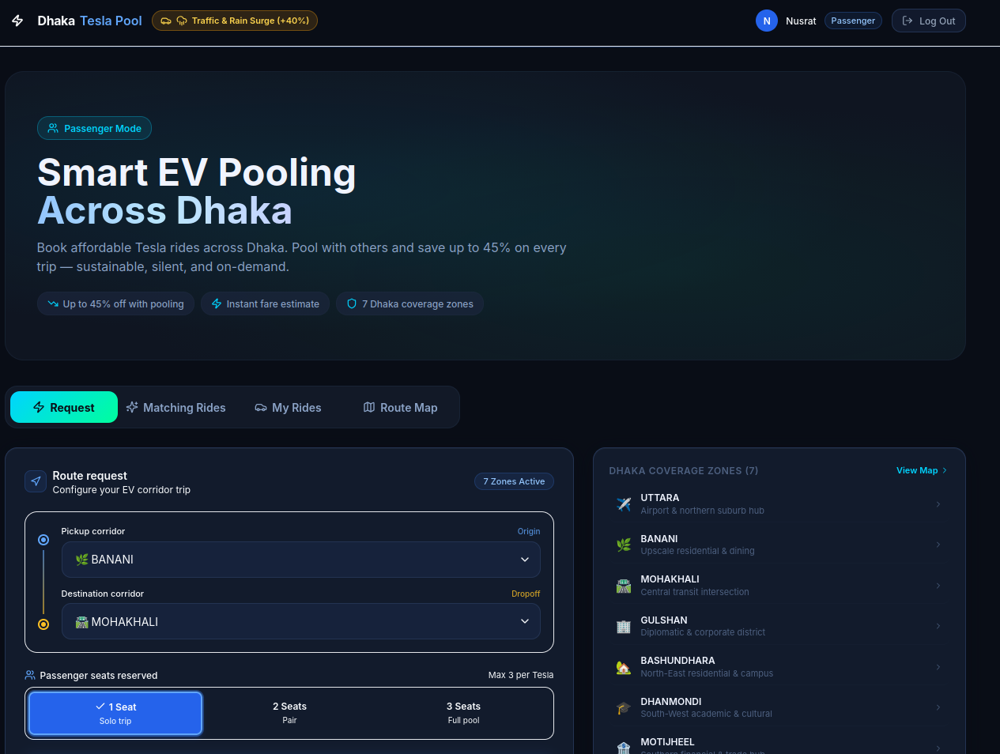
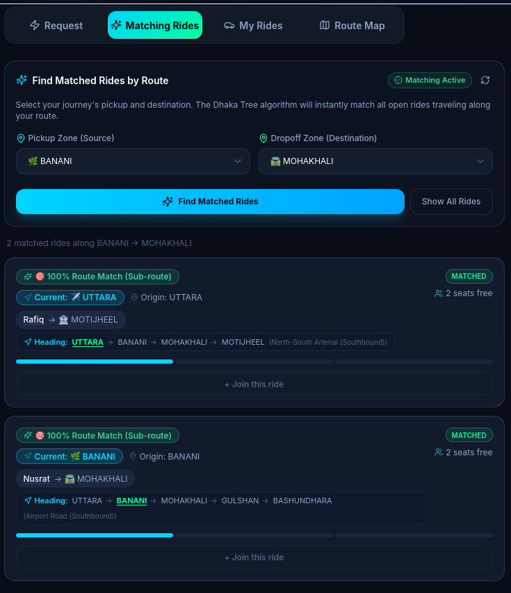
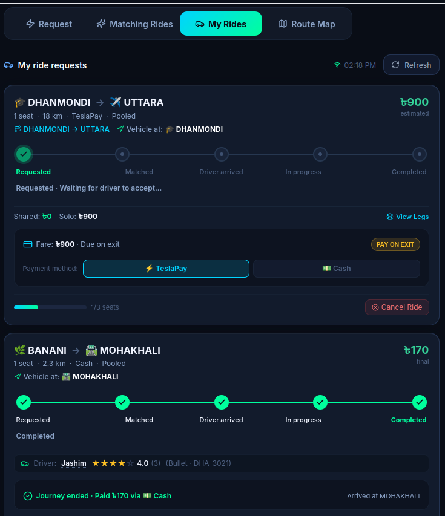
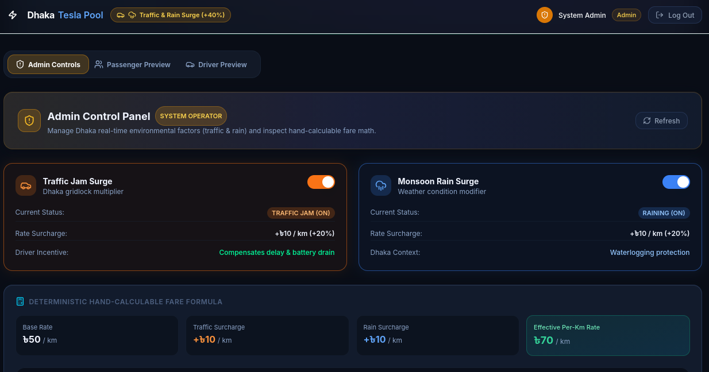
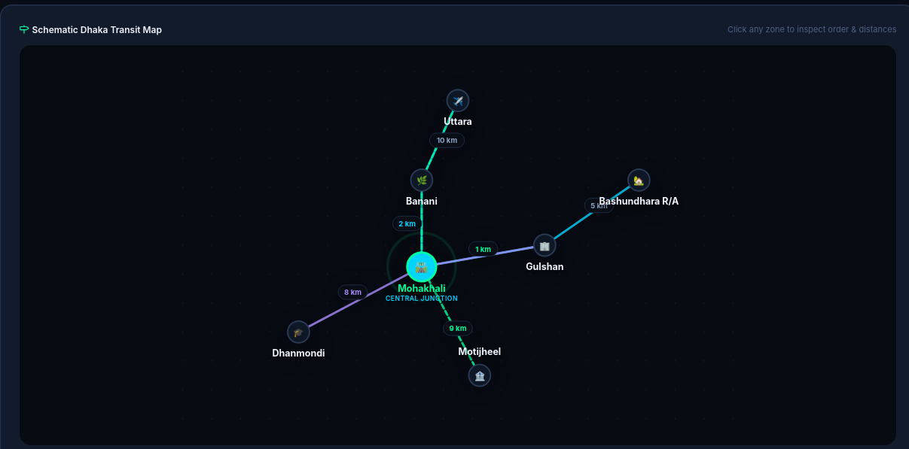
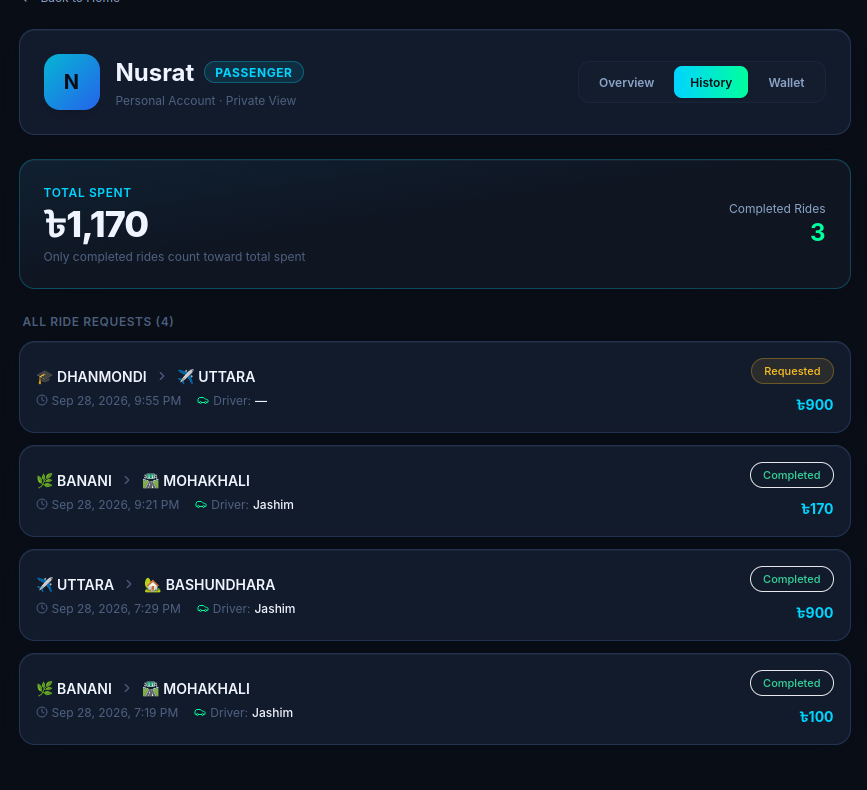
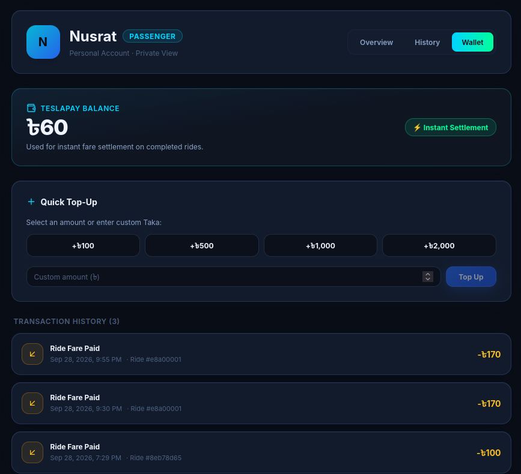

# Dhaka Tesla Pool
> **Share a seat. Split the fare. Survive Dhaka traffic.**

[](https://www.typescriptlang.org/)
[](https://nextjs.org/)
[](https://fastify.dev/)
[](https://www.postgresql.org/)
[](https://www.prisma.io/)
[](https://tailwindcss.com/)
[](https://vitest.dev/)

> 🚀 **Live Web App**: [https://dhaka-tesla-pool-gamma.vercel.app](https://dhaka-tesla-pool-gamma.vercel.app)  
> ⚡ **Live API Backend**: [https://dhaka-tesla-pool-go9a.onrender.com](https://dhaka-tesla-pool-go9a.onrender.com)

---

## 📌 Table of Contents
- [1. Problem Statement & The Story Cast](#1-problem-statement--the-story-cast)
- [2. System Architecture](#2-system-architecture)
- [3. Entity-Relationship Diagram (ERD)](#3-entity-relationship-diagram-erd)
- [4. Core Features Implemented](#4-core-features-implemented)
- [5. Application Screenshots & UI Showcase](#5-application-screenshots--ui-showcase)
- [6. Technology Choices & Justification](#6-technology-choices--justification)
- [7. Key Engineering Decisions & Trade-offs](#7-key-engineering-decisions--trade-offs)
- [8. Concurrency & Overbooking Prevention](#8-concurrency--overbooking-prevention)
- [9. Fare Calculation & Financial Precision](#9-fare-calculation--financial-precision)
- [10. Dhaka City Tree Topology & Ride Matching Algorithm](#10-dhaka-city-tree-topology--ride-matching-algorithm)
- [11. Route Direction & Reverse-Passenger Prevention](#11-route-direction--reverse-passenger-prevention)
- [12. Ride Lifecycle & State Machine](#12-ride-lifecycle--state-machine)
- [13. API Overview](#13-api-overview)
- [14. Project Structure](#14-project-structure)
- [15. Local Setup & Docker Deployment](#15-local-setup--docker-deployment)
- [16. Deployment & Cloud Hosting](#16-deployment--cloud-hosting)
- [17. Demo Credentials](#17-demo-credentials)
- [18. Testing Suite](#18-testing-suite)
- [19. Known Limitations & Next Improvements](#19-known-limitations--next-improvements)
- [20. Bonus: "If Oi Tesla Goes Viral" (1M Scale Blueprint)](#20-bonus-if-oi-tesla-goes-viral-1m-scale-blueprint)
- [21. AI Usage Disclosure](#21-ai-usage-disclosure)
- [22. Git Workflow & Branching](#22-git-workflow--branching)
- [23. Six-Minute Demo Video Walkthrough](#23-six-minute-demo-video-walkthrough)

---

## 1. Problem Statement & The Story Cast

Dhaka's rush-hour traffic on Airport Road and Mirpur-Gulshan link roads is notorious. Commuters travelling in the exact same direction often take separate vehicles or wait hours for scarce transport. 

**The Banani Rush-Hour Story:**
- **Jashim** drives **"Bullet"**, his 3-seater, battery-powered, entirely unaffiliated electric "Tesla".
- **Nusrat**, running late, requests a ride from **Banani** to **Mohakhali**.
- Two minutes later, **Rafiq** requests almost the same route from **Banani** to **Gulshan 1**.
- Thirty seconds later, **Shirin** wants the last remaining seat.

**Dhaka Tesla Pool** is a real-time ride-pooling platform built to:
1. Dynamically match passengers moving along compatible corridors without exceeding Bullet's strict 3-seat capacity.
2. Fairly calculate, discount, and split the fare leg-by-leg so passengers save 30% when sharing while Jashim earns a higher combined payout.
3. Prevent reverse-direction bookings (e.g. travelling backward from Mohakhali to Banani while the vehicle heads southbound toward Bashundhara).
4. Provide seamless exit payments via simulated **TeslaPay Wallet** (atomic wallet debit/credit) or **Cash** (with driver verification handshake).
5. Maintain immutable ride history, passenger reviews, and live notifications.

---

## 2. System Architecture

The project is structured as a high-performance **monorepo**:
- **Frontend (`apps/web`)**: Next.js 14 App Router with React, Tailwind CSS, and Lucide Icons.
- **Backend (`apps/api`)**: Fastify Node.js server with TypeScript, Prisma ORM, and JWT authentication.
- **Database**: PostgreSQL 16 relational database with row-level locks and ACID transaction isolation.

### Main Architecture Diagram


---

## 3. Entity-Relationship Diagram (ERD)


---

## 4. Core Features Implemented

### 🚗 Passenger Features
- **Instant Authentication**: Login and registration with role differentiation and preloaded ৳500 demo wallet balance.
- **Corridor & Shared Route Discovery**: Browse all open pools system-wide with real-time seat availability, corridor progression path, and vehicle current location badge.
- **Any-to-Any Boarding**: Board from any forward stop along the vehicle's route and pay only for your shared journey portion.
- **Reverse-Direction Protection**: UI and backend reject reverse bookings (e.g., Mohakhali to Banani while vehicle travels southbound).
- **Pay on Exit (Two Modes)**:
  - **TeslaPay Wallet**: Atomic balance transfer from passenger to driver with automated verification.
  - **Cash Payment**: Driver confirmation handshake prevents fraud.
- **Cancellation Protection**: Cancellation is permitted strictly before a driver accepts. Once accepted, cancellation is locked to protect driver dispatch.
- **Driver Reviews & Star Ratings**: 1-5 star ratings with optional comments.

### 🚙 Driver Features (Jashim & Bullet)
- **Active Pool Management**: Review incoming ride requests, accept pools, and transition stages (`DRIVER_ARRIVED` → `IN_PROGRESS` → `COMPLETED`).
- **Cash Confirmation Handshake**: Single-click verification for passengers paying cash.
- **Settlement Overview**: Live breakdown of which passengers paid via TeslaPay and which paid cash.
- **Driver History**: Completed rides, earnings tally, and passenger ratings.

---

## 5. Application Screenshots & UI Showcase

### 1. Passenger Portal & Route Configuration
*Configure pickup and dropoff corridors, select seat requirements (1–3 seats), and view live Dhaka coverage zones alongside real-time environmental surge notifications.*



---

### 2. Route Matching & Shared Ride Discovery
*The Dhaka Tree algorithm evaluates corridor paths to match compatible active pools, highlighting 100% sub-route matches and available seat capacity.*



---

### 3. Ride Lifecycle Tracking & Pay-on-Exit
*Visual state machine tracking from request to completion (`Requested` → `Matched` → `Driver arrived` → `In progress` → `Completed`) with dual settlement options (TeslaPay Wallet and Cash).*



---

### 4. Admin Control Panel & Dynamic Surcharges
*System operators can toggle Traffic Jam (+20%) and Monsoon Rain (+20%) surcharges in real-time, instantly recalculating the hand-calculable per-kilometer rate.*



---

### 5. Schematic Dhaka Transit Map
*Topological network representing Dhaka's 7 key transit hubs and road distance weights rooted at the central Mohakhali junction.*



---

### 6. Passenger Ride History & Spending Analytics
*Complete audit trail of user journeys, showing completed corridors, timestamps, assigned drivers, and total expenditure.*



---

### 7. TeslaPay Digital Wallet & Instant Settlement
*Built-in wallet displaying real-time balance, one-click quick top-up options, and an immutable transaction ledger for automated ride payments.*



---

## 6. Technology Choices & Justification

| Layer | Picked | Realistic Alternatives | Why It Fits This MVP | What Would Make Us Switch Later |
| :--- | :--- | :--- | :--- | :--- |
| **Frontend** | **Next.js 14 (App Router)** | Vite + React, Remix, Vue.js | Native SSR/SSG, fast component routing, seamless TypeScript integration, and unified full-stack developer experience. | If client bundle size becomes critical on ultra-low-end 2G mobile devices, we could switch to a lightweight Vite + Preact PWA. |
| **Backend** | **Fastify (Node.js)** | Express, NestJS, Go/Fiber | 3x to 5x faster throughput than Express, built-in JSON schema validation, lower memory footprint, and async plugin ecosystem. | If team size scales to 50+ engineers requiring strict modular enterprise abstraction, NestJS or Go microservices might be adopted. |
| **Database** | **PostgreSQL 16** | MySQL, MongoDB, SQLite | ACID compliance, robust pessimistic row-locking (`FOR UPDATE`), advanced indexing, and zero-risk transactional seat counting. | If geospatial ride matching at millions of concurrent coordinate queries requires document sharding, Mongo/DynamoDB with Redis geo-hashing could be introduced. |
| **ORM** | **Prisma** | Drizzle, TypeORM, Kysely | Type-safe migrations, auto-generated TypeScript clients, intuitive relations, and rapid iteration speed for MVP schemas. | If raw query performance and sub-millisecond query generation under high load is needed, Drizzle or raw Kysely would replace it. |
| **Authentication** | **JWT (`@fastify/jwt`) + Bcrypt** | Session cookies, NextAuth, Auth0 | Stateless, low-latency token verification, no centralized session store needed for MVP, and simple role separation. | At high scale, OAuth2/OIDC with Redis token revocation and refresh token rotation would be added for session invalidation. |
| **Testing** | **Vitest** | Jest, Mocha | Near-instant startup, native TypeScript/ESM support, compatibility with Vite/Next.js toolchains, and parallel test execution. | Vitest handles both unit and integration tests seamlessly; no switch needed in the near term. |

---

## 7. Key Engineering Decisions & Trade-offs

| Engineering Decision | Chosen Solution | Alternative Considered | Trade-off Rationale |
| :--- | :--- | :--- | :--- |
| **Concurrency Control** | PostgreSQL Pessimistic Row Locking (`SELECT ... FOR UPDATE`) | In-memory queues / Redis distributed lock | Guarantees atomic seat reservations and zero overbooking without introducing external cache/queue infrastructure for the MVP. |
| **Route & Matchmaking Model** | Deterministic Spanning Tree with Prim's MST & LCA | Google Maps Directions API / OSRM | Provides $\mathcal{O}(1)$ deterministic distance lookups, predictable leg discounts testable by hand, and eliminates third-party API costs/quotas. |
| **Financial Ledger Precision** | Integer Paisa (1 BDT = 100 Paisa) | Floating point (`DECIMAL` / `FLOAT`) | Eliminates IEEE-754 precision drift across multiple pooled legs and wallet balance debits/credits. Conversions happen only on UI formatters. |
| **System Architecture** | Modular Monolith (Fastify + Next.js App Router) | Microservices with Kafka | Adheres strictly to Section 9 of the brief. Keeps operational overhead minimal while achieving 3x-5x the throughput of classic Express stacks. |
| **State Machine Governance** | Server-enforced linear lifecycle checks | Client-side optimistic state transitions | Prevents illegal state jumps (e.g. canceling after `MATCHED` or double payments), ensuring single-source-of-truth consistency in the DB. |

---

## 8. Concurrency & Overbooking Prevention

### The Problem Scenario
Bullet has **1 seat remaining**. At 8:43:00 AM, **Nusrat** and **Shirin** both click *"Confirm & Join"* at the exact same millisecond. In a naive system without concurrency control:
1. Thread A checks `seatsTaken < 3` (True, seatsTaken = 2).
2. Thread B checks `seatsTaken < 3` (True, seatsTaken = 2).
3. Thread A increments seats: `seatsTaken = 3`.
4. Thread B increments seats: `seatsTaken = 4` (**OVERBOOKED!** Bullet only has 3 seats).

### Current MVP Implementation
We solve this using **Pessimistic Row-Level Locking** in PostgreSQL within an ACID transaction:

```typescript
await prisma.$transaction(async (tx) => {
  // 1. Lock the Pool row FOR UPDATE across competing transactions
  const [lockedPool] = await tx.$queryRaw`
    SELECT id, "seatsCap", "seatsTaken", stage 
    FROM "Pool" 
    WHERE id = ${poolId} 
    FOR UPDATE
  `;

  // 2. Strict capacity assertion on locked state
  if (lockedPool.seatsTaken + requestedSeats > lockedPool.seatsCap) {
    throw new RideError(409, 'No available seats remaining in this pool', 'POOL_FULL');
  }

  // 3. Atomically create the ride and increment seatsTaken
  await tx.rideRequest.create({ ... });
  await tx.pool.update({
    where: { id: poolId },
    data: { seatsTaken: lockedPool.seatsTaken + requestedSeats }
  });
});
```
- The second concurrent request is held at `SELECT ... FOR UPDATE` until the first completes.
- Once released, the second request immediately encounters `seatsTaken === 3` and is rejected with `409 Conflict: POOL_FULL`.

### What We Would Change at Scale (100k+ TPS)
1. **Redis Distributed Locks / Lua Scripts**: Maintain atomic seat counters in Redis (`DECRBY available_seats`). The database is only touched after seat reservation succeeds in memory.
2. **Optimistic Locking**: Add a `version` column to the `Pool` table (`UPDATE "Pool" SET seats = ..., version = version + 1 WHERE id = ... AND version = expectedVersion`). Competing transactions retry with exponential backoff.
3. **Queue-Based Fair Queuing**: Inbound join requests for popular corridors are placed onto a FIFO Kafka/RabbitMQ partition per pool, guaranteeing serialized processing without DB lock contention.

---

## 9. Fare Calculation & Financial Precision

### The Overall Fare Formula
$$\text{Effective Rate } (R) = \text{Base Rate} + \text{Traffic Surcharge} + \text{Rain Surcharge}$$
$$\text{Leg Charge} = \text{Distance (km)} \times R$$
$$\text{Discounted Shared Leg} = \text{Leg Charge} \times (1 - 0.30)$$
$$\text{Passenger Total Fare (BDT)} = \sum \text{Shared Discounted Legs} + \sum \text{Solo Full-Rate Legs}$$
$$\text{Stored in DB (Integer Paisa)} = \text{Passenger Total Fare (BDT)} \times 100$$

#### Rates & Multipliers (Calculable by Hand)
- **Base Distance Rate**: **৳50 / km** (based on Dhaka road topology).
- **Traffic Jam Surcharge**: **+৳10 / km** (+20%) when toggled **ON** by Admin.
- **Monsoon Rain Surcharge**: **+৳10 / km** (+20%) when toggled **ON** by Admin.
- **Combined Traffic + Rain**: **+৳20 / km** (+40%) when both are active ($R = 50 + 10 + 10 = \mathbf{৳70\text{ / km}}$).
- **Pooling Discount**: **30% off** on any leg where 2 or more passengers share seats ($0.70 \times \text{Leg Charge}$). Solo detour legs are charged at the undiscounted rate.

---

### Hand-Calculable Benchmark Table (Nusrat & Rafiq Trips)

The evaluator can test every single number below with a pen and paper. All numbers result in clean integers without rounding discrepancies.

#### 1. Nusrat's Trip: Banani → Mohakhali (Distance = 2 km)
| Environmental Condition | Effective Rate ($R$) | Solo Fare ($2 \times R$) | Pooled with Rafiq ($2 \times R \times 0.70$) | Stored in DB (Paisa) |
| :--- | :--- | :--- | :--- | :--- |
| **Standard (Clear & Dry)** | ৳50 / km | **৳100** | **৳70** | `7,000 paisa` |
| **🚦 Traffic Jam Active (+20%)** | ৳60 / km | **৳120** | **৳84** | `8,400 paisa` |
| **🌧️ Monsoon Rain Active (+20%)** | ৳60 / km | **৳120** | **৳84** | `8,400 paisa` |
| **⚡ Traffic + Rain Active (+40%)** | ৳70 / km | **৳140** | **৳98** | `9,800 paisa` |

*Hand calculation verification:*
- Standard Pooled: $2\text{ km} \times 50\text{ ৳/km} = 100\text{ ৳} \xrightarrow{30\% \text{ off}} 100 \times 0.70 = \mathbf{70\text{ BDT}}$ (7000 paisa).
- Traffic Pooled: $2\text{ km} \times 60\text{ ৳/km} = 120\text{ ৳} \xrightarrow{30\% \text{ off}} 120 \times 0.70 = \mathbf{84\text{ BDT}}$ (8400 paisa).
- Rain Pooled: $2\text{ km} \times 60\text{ ৳/km} = 120\text{ ৳} \xrightarrow{30\% \text{ off}} 120 \times 0.70 = \mathbf{84\text{ BDT}}$ (8400 paisa).
- Both Pooled: $2\text{ km} \times 70\text{ ৳/km} = 140\text{ ৳} \xrightarrow{30\% \text{ off}} 140 \times 0.70 = \mathbf{98\text{ BDT}}$ (9800 paisa).

---

#### 2. Rafiq's Trip: Banani → Gulshan 1 (Distance = 3 km total)
*Route Breakdown: 2 km shared with Nusrat to Mohakhali (30% discount) + 1 km solo Mohakhali → Gulshan 1 (full rate).*

$$\text{Rafiq Fare} = (\text{Shared Leg: } 2 \text{ km} \times R \times 0.70) + (\text{Solo Leg: } 1 \text{ km} \times R)$$

| Environmental Condition | Effective Rate ($R$) | Solo Fare ($3 \times R$) | Pooled Fare Calculation | Total Pooled Fare | Stored in DB (Paisa) |
| :--- | :--- | :--- | :--- | :--- | :--- |
| **Standard (Clear & Dry)** | ৳50 / km | **৳150** | $(2 \times 50 \times 0.7) + (1 \times 50) = 70 + 50$ | **৳120** | `12,000 paisa` |
| **🚦 Traffic Jam Active (+20%)** | ৳60 / km | **৳180** | $(2 \times 60 \times 0.7) + (1 \times 60) = 84 + 60$ | **৳144** | `14,400 paisa` |
| **🌧️ Monsoon Rain Active (+20%)** | ৳60 / km | **৳180** | $(2 \times 60 \times 0.7) + (1 \times 60) = 84 + 60$ | **৳144** | `14,400 paisa` |
| **⚡ Traffic + Rain Active (+40%)** | ৳70 / km | **৳210** | $(2 \times 70 \times 0.7) + (1 \times 70) = 98 + 70$ | **৳168** | `16,800 paisa` |

---

### Admin Profile & Environmental Control Panel
System operators can dynamically toggle city environmental factors live from the web UI:
1. Log in with the **Admin account** (`admin@gmail.com` / `password123`) or click **"👑 Admin (Controls)"** in the 1-Click Demo Login panel.
2. Navigate to the **Admin Control Panel** directly from the home view or **Profile → Admin Controls**.
3. Toggle:
   - 🚦 **Traffic Jam**: Turns traffic surge ON/OFF (+20% / +৳10/km).
   - 🌧️ **Monsoon Rain**: Turns rain surge ON/OFF (+20% / +৳10/km).
4. All fare estimates, new ride requests, and active pool joiners immediately adopt the updated effective rate across the application.
5. A live **City Surge Badge** appears in the top navigation bar alerting users to active surges.

---

### Why Integer Paisa/Poysha Over Decimals
Floating-point arithmetic in JavaScript and SQL is notorious for IEEE-754 precision errors:
```javascript
0.1 + 0.2 = 0.30000000000000004 // Fatal for financial ledgers!
```
In **Dhaka Tesla Pool**, all monetary quantities are stored strictly as **integer Paisa** (1 BDT = 100 Paisa):
- ৳50.00 = `5000` paisa
- ৳70.00 = `7000` paisa
- ৳84.00 = `8400` paisa
- ৳98.00 = `9800` paisa
- Currency conversions occur only at the UI display layer via `formatBDT()` and `formatPaisa()`.

---

## 10. Dhaka City Tree Topology & Ride Matching Algorithm

To eliminate routing ambiguity and enable mathematically deterministic ride-pooling, Dhaka's road network is modeled as a **Spanning Tree**:

### Dhaka City Tree Structure Diagram


### The Tree Structure
Dhaka City's 7 key zones form a single connected component with road distance weights:
- **Central Root Hub**: `MOHAKHALI`
- **Edges & Distances (MST via Prim's Algorithm)**:
  - `MOHAKHALI` $\leftrightarrow$ `GULSHAN` (1 km)
  - `MOHAKHALI` $\leftrightarrow$ `BANANI` (2 km)
  - `GULSHAN` $\leftrightarrow$ `BASHUNDHARA` (5 km)
  - `BASHUNDHARA` $\leftrightarrow$ `UTTARA` (8 km)
  - `MOHAKHALI` $\leftrightarrow$ `DHANMONDI` (8 km)
  - `DHANMONDI` $\leftrightarrow$ `MOTIJHEEL` (6 km)
- **Total Edges**: Exactly $N - 1 = 6$ edges connecting all 7 zones with zero cycles.

### Core Algorithmic Mechanics:

1. **Lowest Common Ancestor (LCA) Path Decomposition**:
   - Any trip from zone $A$ to zone $B$ has a **guaranteed unique path**.
   - Path decomposition:
     - **Upward Leg**: $A \to \text{LCA}(A, B)$ (climbing towards root hub).
     - **Downward Leg**: $\text{LCA}(A, B) \to B$ (descending away from root hub).
   - Distance formula:
     $$\text{dist}(A, B) = \text{distFromRoot}(A) + \text{distFromRoot}(B) - 2 \times \text{distFromRoot}(\text{LCA}(A, B))$$
     This allows $\mathcal{O}(1)$ instant distance queries!

2. **Directed Tree-Edge Overlap Matching Algorithm**:
   - A passenger's journey (e.g., Nusrat wanting $S \to D$) and an active pool's route are each decomposed into an ordered list of **Directed Edges**: $[(u_1 \to u_2), (u_2 \to u_3), \dots]$.
   - **Direction Verification**: Only edges with matching direction $(u \to v)$ are shared. Opposite-direction requests along the same branch (`u → v` vs `v → u`) are rejected as `'opposite_direction'`.
   - **Vehicle Precedence**: If the vehicle's `currentLocation` has already passed Nusrat's pickup node, the pool is excluded (`'passed_pickup'`).
   - **Overlap Ratio & Sub-Route Identification**:
     $$\text{Overlap Ratio} = \frac{\sum \text{Distance}(E_{\text{shared}})}{\text{Total Distance}(E_{\text{nusrat}})}$$
     - Ratio $= 1.0 \implies$ **Exact Sub-Route** (100% matched, seamless join).
     - Ratio $> 0 \implies$ **Shared Tree Branch** (partial overlap with automatic leg pooling discounts).

3. **Time Complexity**:
   - Evaluating 1 candidate pool takes $\mathcal{O}(1)$ operations (since tree size $V=7$ is constant).
   - Scanning all $N$ active pools takes **$\mathcal{O}(N)$** total time.

---

## 11. Route Direction & Reverse-Passenger Prevention

A critical issue in ride-pooling is direction compatibility. If Bullet is travelling Southbound along Airport Road:
$$\text{UTTARA (0)} \to \text{BANANI (1)} \to \text{MOHAKHALI (2)} \to \text{GULSHAN (3)} \to \text{BASHUNDHARA (4)}$$

A passenger at **Mohakhali (Index 2)** attempting to book to **Banani (Index 1)** is travelling Northbound (reverse direction). A Southbound vehicle cannot reverse course.

### How It Is Handled:
1. **Corridor Index Validation**:
   ```typescript
   if (corridor.zones.indexOf(pickup) >= corridor.zones.indexOf(destination)) {
     throw new RideError(400, 'Cannot join ride: reverse direction route');
   }
   ```
2. **Current Vehicle Location Tracking**: If Bullet is currently at Mohakhali, passengers cannot board at Uttara or Banani (`pickupIndex < currentLocIndex`).
3. **Frontend Smart Filtering**: The dropoff dropdown dynamically presents **only forward stops** past the selected boarding point, with real-time direction alerts.

---

## 12. Ride Lifecycle & State Machine

```
[REQUESTED] 
    │
    ├── (Driver accepts pool) ─────────────► [MATCHED] (Cancellation Locked)
    │                                            │
    └── (Passenger cancels before driver)        ▼
            │                            [DRIVER_ARRIVED]
            ▼                                    │
       [CANCELLED]                               ▼
                                           [IN_PROGRESS]
                                                 │
                                                 ▼
                                     [ARRIVED_AT_DESTINATION]
                                                 │
                                                 ▼
                                            [COMPLETED]
```

- **Cancellation Rule**: Allowed strictly while in `REQUESTED` stage before driver acceptance. Once a driver accepts (`MATCHED` or later), cancellations are locked.
- **Pay on Exit Handshake**: The passenger exits and pays at `ARRIVED_AT_DESTINATION`. Once settled, the trip is marked `COMPLETED`.

---

## 13. API Overview

All backend endpoints are prefixed with `/api/v1`. Authenticated requests use standard Bearer tokens (`Authorization: Bearer <jwt>`).

| Method | Endpoint | Access | Purpose & Scope |
| :--- | :--- | :--- | :--- |
| `POST` | `/api/v1/auth/signup` | Public | Register passenger or driver account (preloaded ৳500 wallet balance). |
| `POST` | `/api/v1/auth/login` | Public | Authenticate user credentials and return signed JWT. |
| `POST` | `/api/v1/rides/estimate` | Public | Hand-calculable fare estimate across pickup and dropoff corridors. |
| `POST` | `/api/v1/rides/request` | Passenger | Create a new solo ride request or initialize an open pool. |
| `GET` | `/api/v1/rides/browse` | Authenticated | Browse available forward-matching pools along corridor. |
| `POST` | `/api/v1/rides/:poolId/join` | Passenger | Concurrently lock pool row and reserve seat (`FOR UPDATE`). |
| `GET` | `/api/v1/rides/my-rides` | Passenger | List active passenger ride requests and lifecycle status. |
| `POST` | `/api/v1/rides/:id/cancel` | Passenger | Cancel ride strictly while in `REQUESTED` stage. |
| `POST` | `/api/v1/rides/:id/pay` | Passenger | Pay on exit via TeslaPay atomic balance transfer or Cash. |
| `POST` | `/api/v1/rides/:id/rate` | Passenger | Submit 1–5 star driver review and optional feedback. |
| `GET` | `/api/v1/rides/history` | Passenger | Retrieve passenger's completed journeys and total spending. |
| `GET` | `/api/v1/driver/status` | Driver | Fetch active vehicle information, capacity, and current stage. |
| `POST` | `/api/v1/driver/toggle-online` | Driver | Toggle driver availability between Online and Offline. |
| `POST` | `/api/v1/driver/:poolId/accept` | Driver | Accept incoming pool request and transition to `MATCHED`. |
| `POST` | `/api/v1/driver/:poolId/arrived` | Driver | Mark vehicle arrival at corridor boarding node (`DRIVER_ARRIVED`). |
| `POST` | `/api/v1/driver/:poolId/start` | Driver | Start trip progression toward dropoff nodes (`IN_PROGRESS`). |
| `POST` | `/api/v1/driver/:poolId/complete`| Driver | Arrive at destination and prompt passenger payment (`ARRIVED_AT_DESTINATION`). |
| `POST` | `/api/v1/driver/rides/:rideId/confirm-cash` | Driver | Verify and settle passenger cash payment handshake. |
| `GET` | `/api/v1/driver/history` | Driver | Driver earnings summary, completed rides, and ratings tally. |
| `GET` | `/api/v1/wallet` | Authenticated | Fetch current TeslaPay wallet balance and transaction ledger. |
| `POST` | `/api/v1/wallet/topup` | Authenticated | Instant wallet balance top-up (capped at ৳50,000). |
| `GET` | `/api/v1/system/conditions` | Public | Fetch real-time environmental factors (Traffic Jam & Rain Surge). |
| `PATCH`| `/api/v1/system/conditions` | Admin | Toggle Traffic Jam (+20%) and Monsoon Rain (+20%) surcharges. |
| `GET` | `/api/v1/notifications` | Authenticated | Retrieve live in-app passenger and driver notifications. |
| `POST` | `/api/v1/notifications/read-all`| Authenticated | Mark all pending notifications as read. |

---

## 14. Project Structure

```
dhaka-tesla-pool/
├── apps/
│   ├── api/                          # Fastify Backend API Server
│   │   ├── prisma/
│   │   │   ├── schema.prisma         # Data models, enums & relations
│   │   │   └── seed.ts               # Seed data (Jashim, Nusrat, Rafiq, Shirin)
│   │   ├── src/
│   │   │   ├── config/
│   │   │   │   ├── city-tree.ts      # Dhaka Spanning Tree, Prim's MST, LCA & Overlap
│   │   │   │   ├── fare.ts           # Fare engine & discount calculations
│   │   │   │   └── zones.ts          # Dhaka zones, matrix & corridors
│   │   │   ├── modules/
│   │   │   │   ├── auth/             # Login, signup & JWT verification
│   │   │   │   ├── driver/           # Driver trips, accept, confirm-cash
│   │   │   │   ├── notifications/    # Real-time passive alerts
│   │   │   │   ├── rides/            # Request, browse, join, cancel, pay
│   │   │   │   └── wallet/           # TeslaPay topup & transaction ledger
│   │   │   ├── app.ts                # Fastify app setup & routes
│   │   │   └── server.ts             # Server entrypoint (Port 8000)
│   │   └── package.json
│   │
│   └── web/                          # Next.js 14 Frontend Application
│       ├── app/
│       │   ├── page.tsx              # Main dashboard tabs (Browse, My Rides, Driver)
│       │   ├── profile/page.tsx      # Profile, ratings & TeslaPay Wallet tab
│       │   └── layout.tsx            # Global Navbar, Notifications bell, Auth modal
│       ├── components/
│       │   ├── driver/active-pools.tsx
│       │   ├── passenger/
│       │   │   ├── browse-shared-rides.tsx # Route-based match & open pool browsing
│       │   │   ├── my-rides.tsx
│       │   │   └── request-ride-form.tsx
│       │   └── ui/                   # Reusable badges, cards & ratings
│       ├── lib/
│       │   ├── api.ts                # Axios HTTP client & typed endpoints
│       │   ├── auth-context.tsx      # Auth state management
│       │   └── utils.ts              # Currency, formatting & zone emojis
│       └── package.json
│
├── docs/                             # Architecture diagrams & documentation
│   ├── screenshots/                  # Application UI screenshots
│   ├── ER-diagram.png                # Entity-Relationship Diagram
│   └── dhaka-tree.png                # Dhaka city tree diagram
├── Architecture_Diagram.png          # System Architecture Diagram
├── docker-compose.yml                # Full-stack container orchestration (Postgres, API, Web)
├── .env.example                      # Sample environment variables
└── README.md                         # Project documentation
```

---

## 15. Local Setup & Docker Deployment

### Prerequisites
- [Docker](https://www.docker.com/) & Docker Compose (v2.x+)

### Quick Start (Single Command)

```bash
# 1. Clone the repository
git clone https://github.com/Kodarrr/dhaka-tesla-pool.git
cd dhaka-tesla-pool

# 2. Build and run all services
docker compose up --build -d
```

The stack starts automatically in detached mode:
- **PostgreSQL 16**: Initializes database schema and runs health checks.
- **Fastify Backend API**: Pushes Prisma schema, automatically seeds demo cast data (`Jashim`, `Nusrat`, `Rafiq`, `Shirin`), and starts on port `8000`.
- **Next.js 14 Frontend**: Builds production assets and starts on port `3000`.

### Service Endpoints & Healthchecks

| Service | Access URL | Port | Healthcheck Target |
| :--- | :--- | :--- | :--- |
| **Web Frontend** | `http://localhost:3000` | `3000` | HTTP 200 on `/` |
| **Backend API** | `http://localhost:8000` | `8000` | HTTP 200 on `/ready` |
| **PostgreSQL Database** | `localhost:5432` | `5432` | `pg_isready` |

```bash
# View live application logs
docker compose logs -f

# Stop and remove containers
docker compose down
```

---

<details>
<summary><b>Manual Development Setup (Without Docker)</b></summary>

```bash
# 1. Install workspace dependencies
npm install

# 2. Setup environment variables
cp apps/api/.env.example apps/api/.env
cp apps/web/.env.example apps/web/.env.local

# 3. Start local PostgreSQL, run migrations & seed demo cast
cd apps/api
npx prisma db push
npm run seed

# 4. Start API server (Port 8000)
npm run dev

# 5. In a second terminal, start Web frontend (Port 3000)
cd apps/web
npm run dev
```

Visit `http://localhost:3000` in your browser.
</details>

---

## 16. Deployment & Cloud Hosting

### Live Public URLs
- **Web Application**: [https://dhaka-tesla-pool-gamma.vercel.app](https://dhaka-tesla-pool-gamma.vercel.app)
- **API Backend**: [https://dhaka-tesla-pool-go9a.onrender.com](https://dhaka-tesla-pool-go9a.onrender.com)
- **API Ready Endpoint**: [https://dhaka-tesla-pool-go9a.onrender.com/ready](https://dhaka-tesla-pool-go9a.onrender.com/ready)

### Free-Tier Cloud Deployment Notes
In accordance with Section 6 of the project brief (*"free/free-tier only, do not pay. If free backend hosting isn't available, document the constraint and give a reproducible Docker deployment instead"*):
- **Frontend**: Designed for zero-config deployment on **Vercel** or **Render Static Sites** with `NEXT_PUBLIC_API_URL` pointing to the backend.
- **Backend & Database**: Fastify + PostgreSQL 16 can be deployed to **Render (Free Web Service + Free PostgreSQL)**, **Railway**, or **Koyeb**.
- **Reproducible Docker Deployment**: On any virtual private server (e.g. AWS free-tier EC2, DigitalOcean droplet, or local machine), run:
  ```bash
  docker compose up --build -d
  ```
  All services, networking, database push, seed cast data, and container health checks start seamlessly in under 60 seconds.

---

## 17. Demo Credentials

The database is pre-seeded with the story cast and default password `password123`:

| Role | Name | Email | Password | Initial TeslaPay Balance | Details |
| :--- | :--- | :--- | :--- | :--- | :--- |
| **Admin** | **System Operator** | `admin@gmail.com` | `password123` | N/A | Toggles **Traffic Jam** & **Rain Surge** |
| **Driver** | **Jashim** | `jashim@gmail.com` | `password123` | ৳500.00 | Drives **Bullet** (3 seats) |
| **Passenger** | **Nusrat** | `nusrat@gmail.com` | `password123` | ৳500.00 | ---|
| **Passenger** | **Rafiq** | `rafiq@gmail.com` | `password123` | ৳500.00 | ---|
| **Passenger** | **Shirin** | `shirin@gmail.com` | `password123` | ৳500.00 | --- |

---

## 18. Testing Suite

The project includes **101 automated unit and integration tests** verifying critical pooling algorithms, fare calculations, and edge cases.

To run the test suite:
```bash
cd apps/api
npm test
```

### Core Behaviors Tested:
- **Tree Topology & Spanning Tree**: Prim's algorithm connects all 7 zones with 6 edges, zero cycles, and valid LCA routing.
- **Tree Route Overlap Matching**: Exact sub-route recognition, reverse direction prevention, and passed-pickup avoidance.
- **Capacity Limits**: Bullet's 3-seat capacity cannot be exceeded under concurrent join requests.
- **Fare Calculations**: Nusrat and Rafiq's 30% discount matches manual leg-by-leg math down to the exact paisa.
- **Direction Enforcement**: Rejects reverse bookings (e.g., Mohakhali to Banani on a Southbound trip).
- **Current Location Lock**: Rejects boarding at stops the vehicle has already passed.
- **Cancellation Constraints**: Rejects passenger cancellation once driver accepts (`MATCHED` stage).
- **Safe Pool Exit**: Cancelling does not corrupt remaining riders' fares or trigger mismatched pickup errors.

---

## 19. Known Limitations & Next Improvements

### Current MVP Limitations
1. **Short-Polling (5-Second Intervals)**: The frontend currently polls `/api/v1/rides/my-rides` and driver endpoints every 5 seconds rather than maintaining a persistent bi-directional WebSocket connection.
2. **Fixed 7-Zone Network**: Trips are mapped to predefined arterial nodes (`UTTARA`, `BANANI`, `MOHAKHALI`, `GULSHAN`, `BASHUNDHARA`, `DHANMONDI`, `MOTIJHEEL`) rather than arbitrary continuous coordinate polyline paths.
3. **Simulated Wallet & Gateway**: TeslaPay operates on an internal ACID transactional ledger rather than integrating an external mobile financial service (bKash, Nagad, SSLCommerz).
4. **Single-Vehicle Focus**: Built around Jashim and his 3-seater "Bullet" EV to demonstrate core pooling, reverse prevention, and concurrency logic.

### Next Production Improvements
- **WebSockets / Server-Sent Events (SSE)**: Replace polling with event-driven subscriptions for instant vehicle location and ride stage transitions.
- **PostGIS Spatial Coordinates**: Expand tree nodes to continuous GPS coordinates with geo-fencing and spatial radius queries.
- **Redis In-Memory Distributed Caching**: Offload frequent rate estimates and active pool lookups from PostgreSQL to Redis.
- **Commercial MFS Gateway Handshake**: Integrate sandbox bKash and Nagad payment webhooks for real Bangladeshi Taka settlements.

---

## 20. Bonus: "If Oi Tesla Goes Viral" (1M Scale Blueprint)

If Dhaka Tesla Pool scales from 1 Tesla to **1,000,000 passengers** and **100,000 drivers**, here is our architectural evolution strategy:

```
[Clients: Mobile Apps & Web]
             │ (HTTPS / WSS)
    [Cloudflare CDN & DDoS Protection]
             │
    [NGINX / Envoy API Gateway & Rate Limiter]
             │
 ┌───────────┴──────────────────────────────┐
 │          Microservice Cluster            │
 │  ┌──────────────┐      ┌──────────────┐  │
 │  │ Auth Service │      │ Ride Matcher │  │
 │  └──────┬───────┘      └──────┬───────┘  │
 └─────────┼─────────────────────┼──────────┘
           │                     │
  ┌────────▼─────────────────────▼──────────┐
  │  Apache Kafka Event Bus (Ride Events)   │
  └────────┬─────────────────────┬──────────┘
           │                     │
 ┌─────────▼──────────────┐   ┌──▼──────────────────────────┐
 │ Redis Cluster          │   │ PostgreSQL Database Cluster │
 │ - Geospatial Indexes   │   │ - Citus Sharded Database    │
 │ - Distributed Locks    │   │ - Primary (Writes)          │
 │ - Live Vehicle Telemetry│  │ - Read Replicas (Queries)   │
 └────────────────────────┘   └─────────────────────────────┘
```

1. **Geospatial Indexing**: Replace static zone matrix with **Redis Geospatial (GEOADD / GEORADIUS)** and PostGIS for sub-10ms driver-passenger proximity matching.
2. **Event-Driven Messaging**: Implement **Apache Kafka** event streaming for trip lifecycle events (`RideRequested`, `DriverAccepted`, `PassengerExited`).
3. **Database Sharding & Read Replicas**: Shard PostgreSQL using **Citus** based on geographical city clusters (Dhaka North vs Dhaka South). Direct analytical and search queries to read replicas.
4. **Distributed Concurrency**: Replace SQL row locks with **Redis Redlock** token buckets for sub-millisecond seat reservations.
5. **Real-Time Communication**: Upgrade 5-second polling to bi-directional **WebSockets** (Socket.io / Redis PubSub) for live GPS vehicle tracking and driver location updates.

---

## 21. AI Usage Disclosure

In compliance with the assessment guidelines:
- **Tools Used**: Google Antigravity, Cursor, Claude 3.5 Sonnet, ChatGPT.
- **Use Cases**: Scaffolding repetitive boilerplate (Prisma relations, Tailwind styling), auditing edge cases in distance calculations, and generating unit test scenarios.
- **One Accepted Suggestion**: Utilizing **PostgreSQL row-level locking (`SELECT ... FOR UPDATE`)** inside Prisma transactions. This guaranteed atomic capacity checks and prevented race conditions during simultaneous bookings.
- **One Rejected/Modified Suggestion**: An initial AI proposal suggested adding Apache Kafka and Redis microservices for the MVP. We **rejected** this to adhere to Section 9 (*"Do not introduce microservices, Kafka, Kubernetes, Redis, or queues just to look advanced"*). Instead, we achieved high performance and strict consistency using native PostgreSQL transactions and Fastify.

---

## 22. Git Workflow & Branching

The repository strictly follows the branching strategy described in Section 10 of the brief:
- **`master`**: Stable production-ready baseline.
- **`pre-release`**: Integration branch for release stabilization and documentation checks.
- **`release/v1.0.0`**: Final submission release branch.
- **Feature Branches**:
  - `feature/fastify-server-setup`: API backend initialization and plugins.
  - `feature/user-auth`: JWT authentication and role-based guards.
  - `feature/tesla-pooling`: Corridor matching and atomic seat capacity management.
  - `feature/payment-and-concurrency`: TeslaPay wallet, row-locking, and cash confirmation handshake.
  - `feature/front-end`: Next.js 14 App Router, responsive styling, and live status UI.

---

## 23. Six-Minute Demo Video Walkthrough

> 🎥 **[Click Here to Watch the Video Walkthrough on Loom](https://www.loom.com/share/f7333cbfd0714666a1c74e72bb754d4e)** *(Duration: 8 min 23 sec)*

### Video Timeline Breakdown:
- **0:00 – 1:30 | Problem Understanding & Story Cast**: The Dhaka rush-hour dilemma, corridor matching as the primary problem, cast introductions (Jashim, Bullet, Nusrat, Rafiq).
- **1:30 – 3:45 | Architecture, Tree Topology & Key Decisions**: Walkthrough of Fastify + Prisma + Next.js architecture, ERD database design, Prim's MST & LCA routing trade-off, and PostgreSQL `SELECT ... FOR UPDATE` row-locking for concurrency.
- **3:45 – 7:30 | Live Product Tour & Edge Cases**:
  - Passenger flow: Nusrat booking Banani to Mohakhali corridor.
  - Driver flow: Jashim accepting pool, marking arrival, and starting trip.
  - Reverse-direction rejection demonstration.
  - 100% Sub-route matching with 30% pooling discount (Rafiq).
  - Exit payment handshake (TeslaPay auto-debit and cash confirmation).
- **7:30 – 8:28 | Administrative Controls & Conclusion**: Overview of administrative panel functionality and real-time environmental factor management—such as traffic congestion and inclement weather—featuring an automated 20% fare surcharge in both scenarios, followed by concluding remarks.
---

## Author

**Shah Md Khalil Ullah**

- [cite: Email](mailto:sm.khalil.ullah.26@gmail.com)
- [cite: LinkedIn](https://www.linkedin.com/in/shah-md-khalil-ullah-02396b2b0/) 
